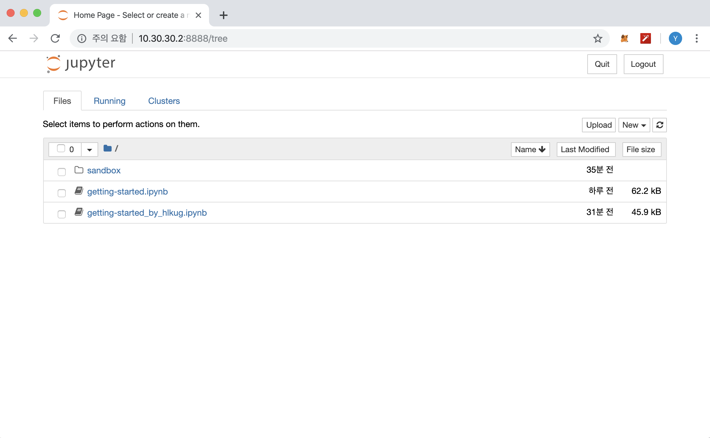

# 1. VM 구동

아래 명령어를 통해서 중지된 VM을 구동합니다.

```shell
$ ls
Vagrantfile
$ vagrant status
Current machine states:

indy-1                    poweroff (virtualbox)

The VM is powered off. To restart the VM, simply run `vagrant up`

$ vagrant up
Bringing machine 'indy-1' up with 'virtualbox' provider...
==> indy-1: Clearing any previously set forwarded ports...
==> indy-1: Clearing any previously set network interfaces...
==> indy-1: Preparing network interfaces based on configuration...
    indy-1: Adapter 1: nat
    indy-1: Adapter 2: hostonly
==> indy-1: Forwarding ports...
    indy-1: 22 (guest) => 2222 (host) (adapter 1)
==> indy-1: Running 'pre-boot' VM customizations...
==> indy-1: Booting VM...
==> indy-1: Waiting for machine to boot. This may take a few minutes...
    indy-1: SSH address: 127.0.0.1:2222
    indy-1: SSH username: vagrant
    indy-1: SSH auth method: private key
==> indy-1: Machine booted and ready!
==> indy-1: Checking for guest additions in VM...
    indy-1: The guest additions on this VM do not match the installed version of
    indy-1: VirtualBox! In most cases this is fine, but in rare cases it can
    indy-1: prevent things such as shared folders from working properly. If you see
    indy-1: shared folder errors, please make sure the guest additions within the
    indy-1: virtual machine match the version of VirtualBox you have installed on
    indy-1: your host and reload your VM.
    indy-1:
    indy-1: Guest Additions Version: 5.1.38
    indy-1: VirtualBox Version: 6.0
==> indy-1: Setting hostname...
==> indy-1: Configuring and enabling network interfaces...
==> indy-1: Mounting shared folders...
    indy-1: /vagrant => /Users/yunho.chung/Vagrant/indy
==> indy-1: Machine already provisioned. Run `vagrant provision` or use the `--provision`
==> indy-1: flag to force provisioning. Provisioners marked to run always will still run.

$ vagrant status
Current machine states:

indy-1                    running (virtualbox)

The VM is running. To stop this VM, you can run `vagrant halt` to
shut it down forcefully, or you can run `vagrant suspend` to simply
suspend the virtual machine. In either case, to restart it again,
simply run `vagrant up`.
```


# 2. VM 접속, 실습 파일 다운로드 및 적용

## 2.1 VM 접속

```shell
$ vagrant ssh indy-1 
vagrant ssh indy-1
Welcome to Ubuntu 16.04.6 LTS (GNU/Linux 4.4.0-165-generic x86_64)

 * Documentation:  https://help.ubuntu.com
 * Management:     https://landscape.canonical.com
 * Support:        https://ubuntu.com/advantage

7 packages can be updated.
0 updates are security updates.

New release '18.04.2 LTS' available.
Run 'do-release-upgrade' to upgrade to it.


Last login: Wed Oct 16 13:06:17 2019 from 10.0.2.2
vagrant@indy-1:~$ 
```

## 2.1 실습 파일 다운로드 및 적용

```shell
# HLKUG meetup Repository Clone
vagrant@indy-1:~$ git clone http://github.com/hlkug/meetup
Cloning into 'meetup'...
remote: Enumerating objects: 74, done.
remote: Counting objects: 100% (74/74), done.
remote: Compressing objects: 100% (47/47), done.
remote: Total 577 (delta 24), reused 62 (delta 13), pack-reused 503
Receiving objects: 100% (577/577), 70.37 MiB | 14.16 MiB/s, done.
Resolving deltas: 100% (174/174), done.
Checking connectivity... done.

vagrant@indy-1:~$ cd meetup/201910/vagrant/
vagrant@indy-1:~/meetup/201910/vagrant$ ls
docker-compose.yml  getting-started_by_hlkug.ipynb

# docker-compose.yml, getting-started_by_hlkug.ipynb 파일 복사
vagrant@indy-1:~/meetup/201910/vagrant$ cp * /home/vagrant/indy-sdk/docs/getting-started
```


# 3. "Getting Started" 예제 구동

## 3.1 IP 확인

Host에서 VM에 접속하기 위해 VM의 IP를 확인합니다. 

아래 처럼 enp0s8 인터페이스에 10.30.30.2 주소가 할당된 것을 확인하면 됩니다.

```shell
vagrant@indy-1:~$ ip a
1: lo: <LOOPBACK,UP,LOWER_UP> mtu 65536 qdisc noqueue state UNKNOWN group default qlen 1
    link/loopback 00:00:00:00:00:00 brd 00:00:00:00:00:00
    inet 127.0.0.1/8 scope host lo
       valid_lft forever preferred_lft forever
    inet6 ::1/128 scope host
       valid_lft forever preferred_lft forever
2: enp0s3: <BROADCAST,MULTICAST,UP,LOWER_UP> mtu 1500 qdisc pfifo_fast state UP group default qlen 1000
    link/ether 02:4f:53:5f:29:ef brd ff:ff:ff:ff:ff:ff
    inet 10.0.2.15/24 brd 10.0.2.255 scope global enp0s3
       valid_lft forever preferred_lft forever
    inet6 fe80::4f:53ff:fe5f:29ef/64 scope link
       valid_lft forever preferred_lft forever
3: enp0s8: <BROADCAST,MULTICAST,UP,LOWER_UP> mtu 1500 qdisc pfifo_fast state UP group default qlen 1000
    link/ether 08:00:27:1f:0e:af brd ff:ff:ff:ff:ff:ff
    inet 10.30.30.2/24 brd 10.30.30.255 scope global enp0s8
       valid_lft forever preferred_lft forever
    inet6 fe80::a00:27ff:fe1f:eaf/64 scope link
       valid_lft forever preferred_lft forever
4: br-c599af41ad75: <NO-CARRIER,BROADCAST,MULTICAST,UP> mtu 1500 qdisc noqueue state DOWN group default
    link/ether 02:42:da:af:44:b0 brd ff:ff:ff:ff:ff:ff
    inet 10.0.0.1/24 brd 10.0.0.255 scope global br-c599af41ad75
       valid_lft forever preferred_lft forever
5: docker0: <NO-CARRIER,BROADCAST,MULTICAST,UP> mtu 1500 qdisc noqueue state DOWN group default
    link/ether 02:42:d7:74:51:a8 brd ff:ff:ff:ff:ff:ff
    inet 172.17.0.1/16 brd 172.17.255.255 scope global docker0
       valid_lft forever preferred_lft forever
```

## 3.2 Docker Compose 구동

"Getting Started" 예제를 위해 두개의 컨테이너가 제공 됩니다.

* indy_pool - Hyperledger Indy Network 컨테이너, Indy Pool
* getting_started - Jupyter Notebook 컨테이너, 제공되는 Python 코드 예제 실습

```shell
# "Getting Started" 관련 파일은 Indy SDK 내 /docs/getting-started 폴더에 있습니다.
vagrant@indy-1:~$ cd /home/vagrant/indy-sdk/docs/getting-started
vagrant@indy-1:~/indy-sdk/docs/getting-started$ ls
docker-compose.yml              getting-started.ipynb  index.rst               sources.list
getting-started_by_hlkug.ipynb  getting-started.puml   indy-walkthrough.md     Trouble_shoot_GSG.md
getting-started.dockerfile      getting-started.svg    run-getting-started.md

# Docker Compose 구동
vagrant@indy-1:~/indy-sdk/docs/getting-started$ docker-compose up
vagrant@indy-1:~/indy-sdk/docs/getting-started$ docker-compose up
Starting indy_pool ... done
Starting getting_started ... done
Attaching to indy_pool, getting_started
indy_pool    | 2019-10-16 13:38:44,627 CRIT Set uid to user 1000
getting_started | [I 13:38:45.977 NotebookApp] Serving notebooks from local directory: /home/indy
getting_started | [I 13:38:45.978 NotebookApp] The Jupyter Notebook is running at:
getting_started | [I 13:38:45.978 NotebookApp] http://41a8549296f0:8888/?token=5e1930e863051a6a5dd836b3855c791bd1e8681cab7fd251
getting_started | [I 13:38:45.978 NotebookApp]  or http://127.0.0.1:8888/?token=5e1930e863051a6a5dd836b3855c791bd1e8681cab7fd251
getting_started | [I 13:38:45.978 NotebookApp] Use Control-C to stop this server and shut down all kernels (twice to skip confirmation).
getting_started | [W 13:38:45.987 NotebookApp] No web browser found: could not locate runnable browser.
getting_started | [C 13:38:45.988 NotebookApp]
getting_started |
getting_started |     To access the notebook, open this file in a browser:
getting_started |         file:///home/indy/.local/share/jupyter/runtime/nbserver-1-open.html
getting_started |     Or copy and paste one of these URLs:
getting_started |         http://41a8549296f0:8888/?token=5e1930e863051a6a5dd836b3855c791bd1e8681cab7fd251
getting_started |      or http://127.0.0.1:8888/?token=5e1930e863051a6a5dd836b3855c791bd1e8681cab7fd251
```

## 3.3 Jupyter Notebook 접속

Docker Compose 구동 후 출력되는 로그에서 URL을 복사해서 127.0.0.1 부분을 VM IP로 변경한 후 Host에서 웹브라우저(크롬)으로 접속합니다. 아래 토큰 값은 컨테이너(getting_started) 구동 시 임의의 값으로 변경되는 값입니다.

* http://127.0.0.1:8888/?token=5e1930e863051a6a5dd836b3855c791bd1e8681cab7fd251

  --> http://10.30.30.2:8888/?token=5e1930e863051a6a5dd836b3855c791bd1e8681cab7fd251

