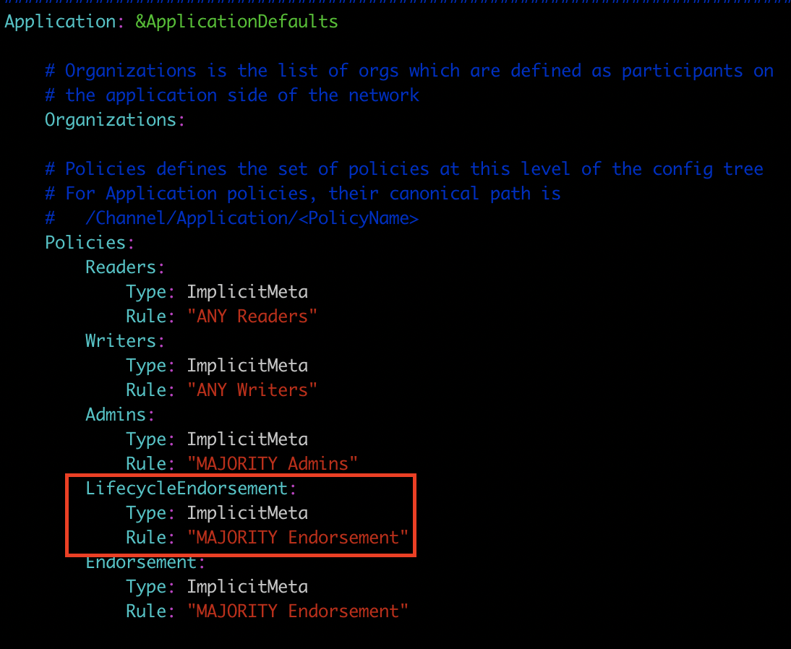
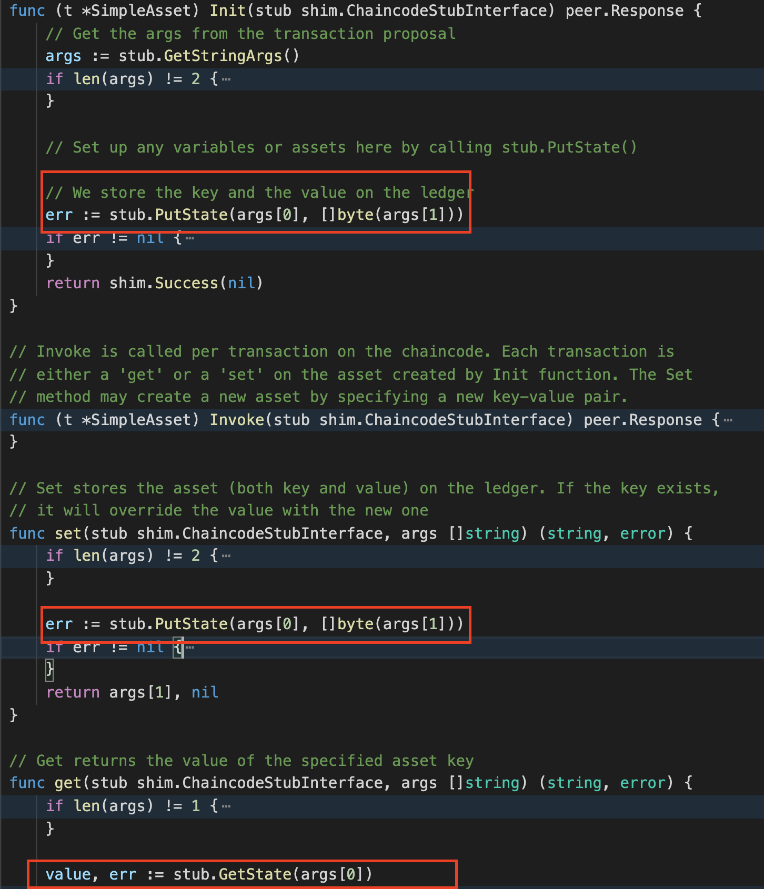

Table of Contents
=================

   * [1. VM 설치](#1-vm-설치)
   * [2. VM 구동](#2-vm-구동)
   * [3. BYFN 구동 및 SACC 실습](#3-byfn-구동-및-sacc-실습)
      * [3.1 VM 접속](#31-vm-접속)
      * [3.2 BYFN 구동](#32-byfn-구동)
      * [3.3 SACC 체인코드 패키징](#33-sacc-체인코드-패키징)
      * [3.4 SACC 체인코드 설치(패키지) - peer0.org1, peer0.org2](#34-sacc-체인코드-설치패키지---peer0org1-peer0org2)
      * [3.4 SACC 체인코드 승인 - org1, org2](#34-sacc-체인코드-승인---org1-org2)
      * [3.5 SACC 체인코드 커밋(instantiate)](#35-sacc-체인코드-커밋instantiate)
      * [3.6 SACC 체인코드 초기화](#36-sacc-체인코드-초기화)
      * [3.7 SACC 체인코드 실행](#37-sacc-체인코드-실행)


# 1. VM 설치

Vagrant가 처음이신 분이시거나 Hyperledger Fabric v2.1.x VM이 미설치되신 분은 아래 가이드를 통해 설치하시면 됩니다.

* [Vagrant를 이용하여 하이퍼레저 패브릭 VM 구성하기](https://github.com/hlkug/meetup/blob/master/000000/vagrant/hyperledger_fabric/README.md)

* Hyperledger FAbric v2.1.x Vagrant file - https://github.com/hlkug/meetup/blob/master/000000/vagrant/hyperledger_fabric/2.1.x/Vagrantfile

  

# 2. VM 구동

아래 명령어를 통해서 중지된 VM을 구동합니다.

```shell
$ ls
Vagrantfile
$ vagrant status
Current machine states:

node2-1                   poweroff (virtualbox)

The VM is powered off. To restart the VM, simply run `vagrant up`

$ vagrant up
Bringing machine 'node2-1' up with 'virtualbox' provider...
==> node2-1: Clearing any previously set forwarded ports...
==> node2-1: Clearing any previously set network interfaces...
==> node2-1: Preparing network interfaces based on configuration...
    node2-1: Adapter 1: nat
    node2-1: Adapter 2: hostonly
==> node2-1: Forwarding ports...
    node2-1: 22 (guest) => 2222 (host) (adapter 1)
==> node2-1: Running 'pre-boot' VM customizations...
==> node2-1: Booting VM...
==> node2-1: Waiting for machine to boot. This may take a few minutes...
    node2-1: SSH address: 127.0.0.1:2222
    node2-1: SSH username: vagrant
    node2-1: SSH auth method: private key
==> node2-1: Machine booted and ready!
==> node2-1: Checking for guest additions in VM...
==> node2-1: Setting hostname...
==> node2-1: Configuring and enabling network interfaces...
==> node2-1: Mounting shared folders...
    node2-1: /vagrant => /Users/yunho.chung/Vagrant/fabric/2.1.x
==> node2-1: Machine already provisioned. Run `vagrant provision` or use the `--provision`
==> node2-1: flag to force provisioning. Provisioners marked to run always will still run.

$ vagrant status
Current machine states:

node2-1                   running (virtualbox)

The VM is running. To stop this VM, you can run `vagrant halt` to
shut it down forcefully, or you can run `vagrant suspend` to simply
suspend the virtual machine. In either case, to restart it again,
simply run `vagrant up`.
```


# 3. BYFN 구동 및 SACC 실습

## 3.1 VM 접속

```shell
$ vagrant ssh
Welcome to Ubuntu 18.04.2 LTS (GNU/Linux 4.15.0-51-generic x86_64)

 * Documentation:  https://help.ubuntu.com
 * Management:     https://landscape.canonical.com
 * Support:        https://ubuntu.com/advantage

  System information as of Sun Apr 19 14:11:40 UTC 2020

  System load:  0.14              Users logged in:        0
  Usage of /:   7.6% of 61.80GB   IP address for eth0:    10.0.2.15
  Memory usage: 8%                IP address for eth1:    10.20.20.2
  Swap usage:   0%                IP address for docker0: 172.17.0.1
  Processes:    93


158 packages can be updated.
103 updates are security updates.


Last login: Sun Apr 19 13:40:41 2020 from 10.0.2.2
vagrant@node2-1:~$
```

## 3.2 BYFN 구동

```shell
vagrant@node2-1:~$ cd fabric-samples/first-network/
vagrant@node2-1:~/fabric-samples/first-network$ ./byfn.sh up -n
Starting for channel 'mychannel' with CLI timeout of '10' seconds and CLI delay of '3' seconds
Continue? [Y/n] y
proceeding ...
LOCAL_VERSION=2.1.0
DOCKER_IMAGE_VERSION=2.1.0
/home/vagrant/fabric-samples/first-network/../bin/cryptogen

##########################################################
##### Generate certificates using cryptogen tool #########
##########################################################
+ cryptogen generate --config=./crypto-config.yaml
org1.example.com
org2.example.com
+ res=0
+ set +x

....

===================== Anchor peers updated for org 'Org1MSP' on channel 'mychannel' =====================

Updating anchor peers for org2...
+ peer channel update -o orderer.example.com:7050 -c mychannel -f ./channel-artifacts/Org2MSPanchors.tx --tls true --cafile /opt/gopath/src/github.com/hyperledger/fabric/peer/crypto/ordererOrganizations/example.com/orderers/orderer.example.com/msp/tlscacerts/tlsca.example.com-cert.pem
+ res=0
+ set +x
2020-04-19 14:15:56.636 UTC [channelCmd] InitCmdFactory -> INFO 001 Endorser and orderer connections initialized
2020-04-19 14:15:56.647 UTC [channelCmd] update -> INFO 002 Successfully submitted channel update
===================== Anchor peers updated for org 'Org2MSP' on channel 'mychannel' =====================


========= All GOOD, BYFN execution completed ===========


 _____   _   _   ____
| ____| | \ | | |  _ \
|  _|   |  \| | | | | |
| |___  | |\  | | |_| |
|_____| |_| \_| |____/

vagrant@node2-1:~/fabric-samples/first-network$
```

## 3.3 SACC 체인코드 패키징

```shell
# 체인코드 빌드
vagrant@node2-1:$ cd ~/fabric-samples/chaincode/sacc
vagrant@node2-1:~/fabric-samples/chaincode/sacc$ GO111MODULE=on go mod vendor
vagrant@node2-1:~/fabric-samples/chaincode/sacc$ cd ~/fabric-samples/first-network

# (CLI 컨테이너 내)체인코드 패키지 생성
vagrant@node2-1:~/fabric-samples/first-network$ docker exec cli peer lifecycle chaincode package sacc.tar.gz --path github.com/hyperledger/fabric-samples/chaincode/sacc/ --label sacc_1
# 체인코드 패키지 확인
vagrant@node2-1:~/fabric-samples/first-network$ docker exec cli ls
channel-artifacts
crypto
log.txt
mychannel.block
sacc.tar.gz
scripts
```

## 3.4 SACC 체인코드 설치(패키지) - peer0.org1, peer0.org2

```shell
# peer0.org1
vagrant@node2-1:$ docker exec cli peer lifecycle chaincode install sacc.tar.gz

2020-04-19 14:30:44.051 UTC [cli.lifecycle.chaincode] submitInstallProposal -> INFO 001 Installed remotely: response:<status:200 payload:"\nGsacc_1:1bfe84738f826868c2a15b7165faafe9172204bc447b0d8e0ac5ae925264a514\022\006sacc_1" >
2020-04-19 14:30:44.052 UTC [cli.lifecycle.chaincode] submitInstallProposal -> INFO 002 Chaincode code package identifier: sacc_1:1bfe84738f826868c2a15b7165faafe9172204bc447b0d8e0ac5ae925264a514
## 패키지 ID - sacc_1:1bfe84738f826868c2a15b7165faafe9172204bc447b0d8e0ac5ae925264a514

# peer0.org2
vagrant@node2-1:$ docker exec \
-e CORE_PEER_MSPCONFIGPATH=/opt/gopath/src/github.com/hyperledger/fabric/peer/crypto/peerOrganizations/org2.example.com/users/Admin@org2.example.com/msp \
-e CORE_PEER_ADDRESS=peer0.org2.example.com:9051 \
-e CORE_PEER_LOCALMSPID="Org2MSP" \
-e CORE_PEER_TLS_ROOTCERT_FILE=/opt/gopath/src/github.com/hyperledger/fabric/peer/crypto/peerOrganizations/org2.example.com/peers/peer0.org2.example.com/tls/ca.crt \
cli peer lifecycle chaincode install sacc.tar.gz

2020-04-19 14:31:17.137 UTC [cli.lifecycle.chaincode] submitInstallProposal -> INFO 001 Installed remotely: response:<status:200 payload:"\nGsacc_1:1bfe84738f826868c2a15b7165faafe9172204bc447b0d8e0ac5ae925264a514\022\006sacc_1" >
2020-04-19 14:31:17.138 UTC [cli.lifecycle.chaincode] submitInstallProposal -> INFO 002 Chaincode code package identifier: sacc_1:1bfe84738f826868c2a15b7165faafe9172204bc447b0d8e0ac5ae925264a514
## 패키지 ID - sacc_1:1bfe84738f826868c2a15b7165faafe9172204bc447b0d8e0ac5ae925264a514

# Peer에 설치된 Chaincode 확인하기
vagrant@node2-1:~$ docker exec cli peer lifecycle chaincode queryinstalled

Installed chaincodes on peer:
Package ID: sacc_1:1bfe84738f826868c2a15b7165faafe9172204bc447b0d8e0ac5ae925264a514, Label: sacc_1
```

## 3.4 SACC 체인코드 승인 - org1, org2

체인코드를 채널에서 사용하기 위해서는 채널에 포함된 Org의 승인이 필요합니다. 승인에 필요한 정족수는 MAJORITY(과반수 이상)입니다. 예를 들어 2개의 Org인 경우 2개의 Org의 승인이 필요합니다.

configtx.yaml 파일의 아래 항목을 통해 정족수 변경을 할 수 있습니다.



```shell
# peer0.org1
# 체인코드 설치 후 결과값으로 출력되었던 패키지 ID 값을 ${PACKAGE_ID}값으로 사용합니다.
vagrant@node2-1:$ docker exec cli peer lifecycle chaincode approveformyorg \
--tls \
--cafile /opt/gopath/src/github.com/hyperledger/fabric/peer/crypto/ordererOrganizations/example.com/orderers/orderer.example.com/msp/tlscacerts/tlsca.example.com-cert.pem \
--channelID mychannel \
--name mycc --version 1 \
--init-required --sequence 1 --waitForEvent \
--package-id ${PACKAGE_ID}

2020-04-19 14:42:48.921 UTC [cli.lifecycle.chaincode] setOrdererClient -> INFO 001 Retrieved channel (mychannel) orderer endpoint: orderer.example.com:7050
2020-04-19 14:42:51.039 UTC [chaincodeCmd] ClientWait -> INFO 002 txid [08dd08be0b0d3425b44e5bba816fc48e7190d86863e59b0a0c2648c48674627e] committed with status (VALID) at

# peer0.org2
vagrant@node2-1:$ docker exec \
-e CORE_PEER_MSPCONFIGPATH=/opt/gopath/src/github.com/hyperledger/fabric/peer/crypto/peerOrganizations/org2.example.com/users/Admin@org2.example.com/msp \
-e CORE_PEER_ADDRESS=peer0.org2.example.com:9051 \
-e CORE_PEER_LOCALMSPID="Org2MSP" \
-e CORE_PEER_TLS_ROOTCERT_FILE=/opt/gopath/src/github.com/hyperledger/fabric/peer/crypto/peerOrganizations/org2.example.com/peers/peer0.org2.example.com/tls/ca.crt \
cli peer lifecycle chaincode approveformyorg \
--tls \
--cafile /opt/gopath/src/github.com/hyperledger/fabric/peer/crypto/ordererOrganizations/example.com/orderers/orderer.example.com/msp/tlscacerts/tlsca.example.com-cert.pem \
--channelID mychannel --name mycc --version 1 \
--init-required --sequence 1 --waitForEvent \
--package-id ${PACKAGE_ID}
2020-04-19 14:45:56.892 UTC [cli.lifecycle.chaincode] setOrdererClient -> INFO 001 Retrieved channel (mychannel) orderer endpoint: orderer.example.com:7050
2020-04-19 14:45:58.991 UTC [chaincodeCmd] ClientWait -> INFO 002 txid [6a11fcd7afbf4f951ca0063f63f21649b95f0539318f0163ba085db72d17c5ff] committed with status (VALID) at
```

## 3.5 SACC 체인코드 커밋(instantiate)

체인코드를 활성화하기 위해 채널에 참여하고 있는 Peer 중 한개의 Peer에서 커밋을 합니다.

```shell
# 승인 상태 확인
vagrant@node2-1:$ docker exec cli peer lifecycle chaincode checkcommitreadiness \
--channelID mychannel --name mycc \
--init-required --version 1 --sequence 1 \
--output json

{
	"approvals": {
		"Org1MSP": true,
		"Org2MSP": true
	}
}

# 체인코드 커밋(instantiate)
vagrant@node2-1:$ docker exec cli peer lifecycle chaincode commit \
-o orderer.example.com:7050 \
--tls \
--cafile /opt/gopath/src/github.com/hyperledger/fabric/peer/crypto/ordererOrganizations/example.com/orderers/orderer.example.com/msp/tlscacerts/tlsca.example.com-cert.pem \
--peerAddresses peer0.org1.example.com:7051 \
--tlsRootCertFiles /opt/gopath/src/github.com/hyperledger/fabric/peer/crypto/peerOrganizations/org1.example.com/peers/peer0.org1.example.com/tls/ca.crt \
--peerAddresses peer0.org2.example.com:9051 \
--tlsRootCertFiles /opt/gopath/src/github.com/hyperledger/fabric/peer/crypto/peerOrganizations/org2.example.com/peers/peer0.org2.example.com/tls/ca.crt \
--channelID mychannel --name mycc --version 1 --sequence 1 \
--init-required

2020-04-19 14:58:25.807 UTC [chaincodeCmd] ClientWait -> INFO 001 txid [e98348e2febd3cccc76ce30a1a47d58d5b4b0a28ab47f6b0b4804852a64a71db] committed with status (VALID) at peer0.org2.example.com:9051
2020-04-19 14:58:25.820 UTC [chaincodeCmd] ClientWait -> INFO 002 txid [e98348e2febd3cccc76ce30a1a47d58d5b4b0a28ab47f6b0b4804852a64a71db] committed with status (VALID) at peer0.org1.example.com:7051

# 체인코드 커밋 상태 확인
vagrant@node2-1:~$ docker exec cli peer lifecycle chaincode querycommitted \
--channelID mychannel --name mycc

Committed chaincode definition for chaincode 'mycc' on channel 'mychannel':
Version: 1, Sequence: 1, Endorsement Plugin: escc, Validation Plugin: vscc, Approvals: [Org1MSP: true, Org2MSP: true]
```

## 3.6 SACC 체인코드 초기화

Fabric v1.4.x 에서는 체인코드 활성화(instantiate)될때 체인코드의 Init() 함수가 호출 되었으나 Fabric v2.0에서는 별도로 호출해야 합니다.



 채널에 참여하고 있는 Peer 중 한개의 Peer에서 초기화를 진행합니다.

```shell
# 일반적인 invoke와는 다르게 초기화하는 경우 옵션으로 '--isInit' 사용
vagrant@node2-1:~$ docker exec cli peer chaincode invoke \
-o orderer.example.com:7050 \
--tls \
--cafile /opt/gopath/src/github.com/hyperledger/fabric/peer/crypto/ordererOrganizations/example.com/orderers/orderer.example.com/msp/tlscacerts/tlsca.example.com-cert.pem \
--peerAddresses peer0.org1.example.com:7051 \
--tlsRootCertFiles /opt/gopath/src/github.com/hyperledger/fabric/peer/crypto/peerOrganizations/org1.example.com/peers/peer0.org1.example.com/tls/ca.crt \
--peerAddresses peer0.org2.example.com:9051 \
--tlsRootCertFiles /opt/gopath/src/github.com/hyperledger/fabric/peer/crypto/peerOrganizations/org2.example.com/peers/peer0.org2.example.com/tls/ca.crt \
-C mychannel -n mycc --isInit -c '{"Args":["name","hlkug"]}'

2020-04-19 15:15:05.631 UTC [chaincodeCmd] chaincodeInvokeOrQuery -> INFO 001 Chaincode invoke successful. result: status:200

# Query
vagrant@node2-1:~$ docker exec cli peer chaincode query \
-C mychannel -n mycc -c '{"Args":["get","name"]}'

hlkug
```

## 3.7 SACC 체인코드 실행

```shell
# Invoke from peer0.org1
vagrant@node2-1:~$ docker exec cli peer chaincode invoke \
-o orderer.example.com:7050 \
--tls \
--cafile /opt/gopath/src/github.com/hyperledger/fabric/peer/crypto/ordererOrganizations/example.com/orderers/orderer.example.com/msp/tlscacerts/tlsca.example.com-cert.pem \
--peerAddresses peer0.org1.example.com:7051 \
--tlsRootCertFiles /opt/gopath/src/github.com/hyperledger/fabric/peer/crypto/peerOrganizations/org1.example.com/peers/peer0.org1.example.com/tls/ca.crt \
--peerAddresses peer0.org2.example.com:9051 \
--tlsRootCertFiles /opt/gopath/src/github.com/hyperledger/fabric/peer/crypto/peerOrganizations/org2.example.com/peers/peer0.org2.example.com/tls/ca.crt \
-C mychannel -n mycc -c '{"Args":["set","name","YH"]}'

# Query from peer0.org2
vagrant@node2-1:~$ docker exec \
-e CORE_PEER_MSPCONFIGPATH=/opt/gopath/src/github.com/hyperledger/fabric/peer/crypto/peerOrganizations/org2.example.com/users/Admin@org2.example.com/msp \
-e CORE_PEER_ADDRESS=peer0.org2.example.com:9051 \
-e CORE_PEER_LOCALMSPID="Org2MSP" \
-e CORE_PEER_TLS_ROOTCERT_FILE=/opt/gopath/src/github.com/hyperledger/fabric/peer/crypto/peerOrganizations/org2.example.com/peers/peer0.org2.example.com/tls/ca.crt \
cli peer chaincode query -C mychannel -n mycc -c '{"Args":["get","name"]}'

YH
```

