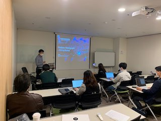

- **주제**
  
  - Getting Started with Hedera Hashgraph - 정연호, Hyperledger Korea User Group
- **일시 및 참석 인원**
  - 일시 : 2020년 10월 14일 수요일 19:00 ~ 20:30
  - 참석 인원 : 29명(오프라인 13명, 온라인 16명)
- **자료**
  - 발표 자료 - https://www.slideshare.net/secret/cjZHc3OoZ1KtQ4
  - 발표 동영상 - https://youtu.be/4bO7kC6P110
- Hedera Hashgraph Resources
  - Company Website - https://www.hedera.com/
  - Discord - https://discordapp.com/invite/FFb9YFX #korean-한국어
  - Telegram - https://t.me/hederahashgraph
  - Twitter - http://twitter.com/hashgraph
  - YouTube - https://www.youtube.com/channel/UCIhE4NYpaX9E9SssFnwrjww

* **밋업 현장**

  