---

---

Table of Contents
=================

   * [0. 참고](#0-참고)
   * [1. 준비사항](#1-준비사항)
      * [1.1 Account 생성](#11-account-생성)
      * [1.2 테스트 환경 구성](#12-테스트-환경-구성)
         * [1.2.1 Hedera SDK](#121-hedera-sdk)
         * [1.2.2 Microsoft Visual Studio Code(VS Code), Node.js 설치](#122-microsoft-visual-studio-codevs-code-nodejs-설치)
         * [1.2.3 실습 소스 다운로드](#123-실습-소스-다운로드)
         * [1.2.4 VS Code에서 소스 코드 열기](#124-vs-code에서-소스-코드-열기)
         * [1.2.5 패키지(라이브러리) 설치](#125-패키지라이브러리-설치)
         * [1.2.6 Account 정보 설정](#126-account-정보-설정)
   * [2. Cryptocurrency](#2-cryptocurrency)
      * [2.1 Balance 확인](#21-balance-확인)
      * [2.2 HBar(tinybar) 송금](#22-hbartinybar-송금)
   * [3. File Service](#3-file-service)
      * [3.1 파일 생성 &amp; 읽기](#31-파일-생성--읽기)
      * [3.2 파일 생성 &amp; 삭제](#32-파일-생성--삭제)
   * [4. Smart Contract](#4-smart-contract)
      * [4.1 스마트 컨트랙트 배포 및 함수 실행](#41-스마트-컨트랙트-배포-및-함수-실행)
   * [5. Consensus Service](#5-consensus-service)
      * [5.1 토픽 생성 및 Submit/Subscribe](#51-토픽-생성-및-submitsubscribe)


[TOC]

# 0. 참고

* Coding With Cooper - https://www.youtube.com/playlist?list=PLcaTa5RR9SuA__8rzCKru8Y_F6iMJPEUD

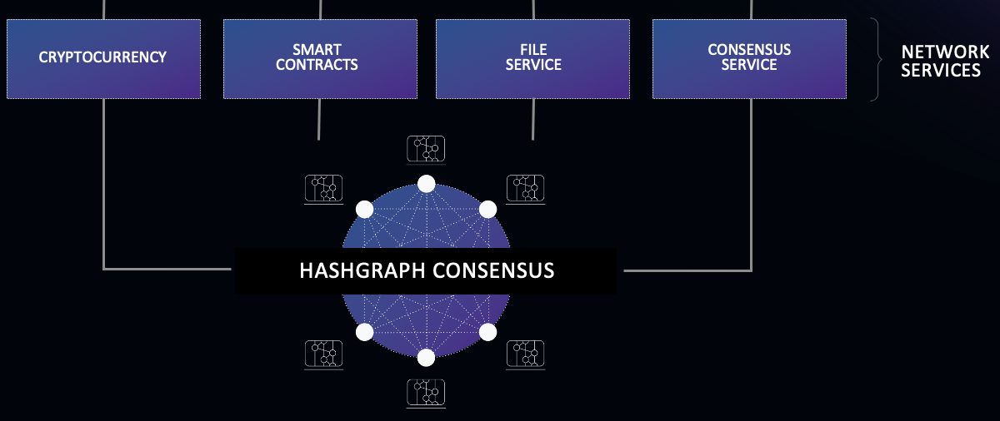

# 1. 준비사항

## 1.1 Account 생성

Hedera 계정은 Private Key, Public Key, Account ID로 구성 되며 아래 사이트를 통해 발급 받을 수 있습니다.

* https://portal.hedera.com

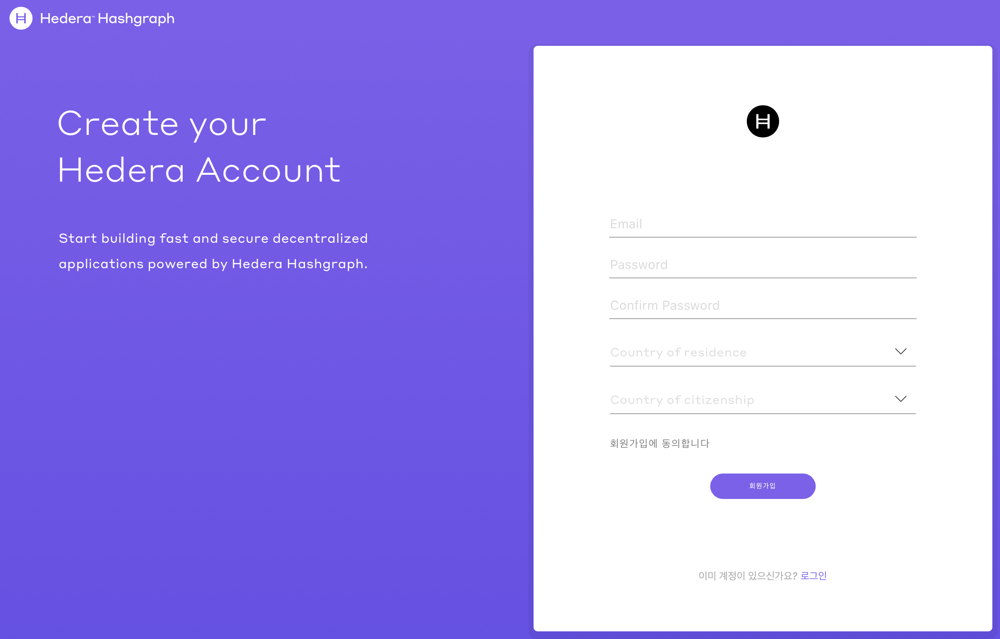

회원 가입 후 실습을 위해 테스트넷(Testnet) Account를 발급 받습니다.

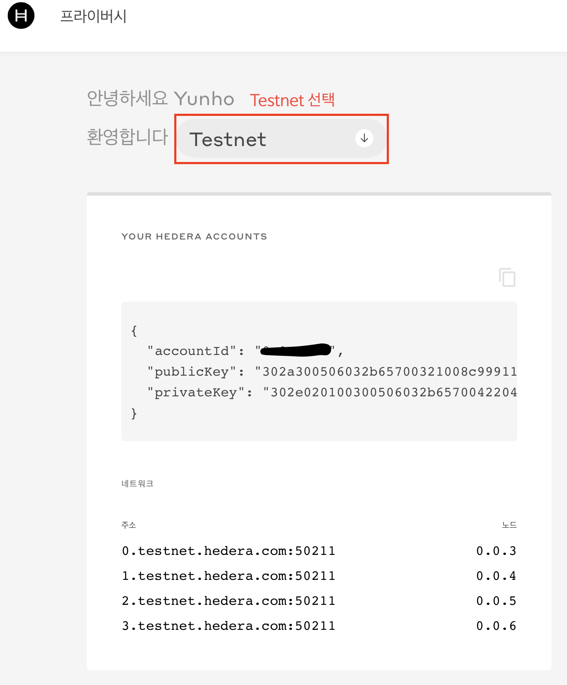


```json
{
    "operator": {
        "accountId": "0.0.1688",
        "publicKey": "302a300506032b65700321008c999110d6",
        "privateKey": "302e020100300506032b6570042204209be"
    },
    "network": {
        "0.testnet.hedera.com:50211": "0.0.3",
        "1.testnet.hedera.com:50211": "0.0.4",
        "2.testnet.hedera.com:50211": "0.0.5",
        "3.testnet.hedera.com:50211": "0.0.6"
    }
}
```

## 1.2 테스트 환경 구성

### 1.2.1 Hedera SDK

Hedera에서 공식적으로 Java/JavaScript/Go SDK를  커뮤니티차원에서 C/iOS/Python/Rust/.NET SDK를 지원하고 있습니다. https://docs.hedera.com/guides/docs/sdks

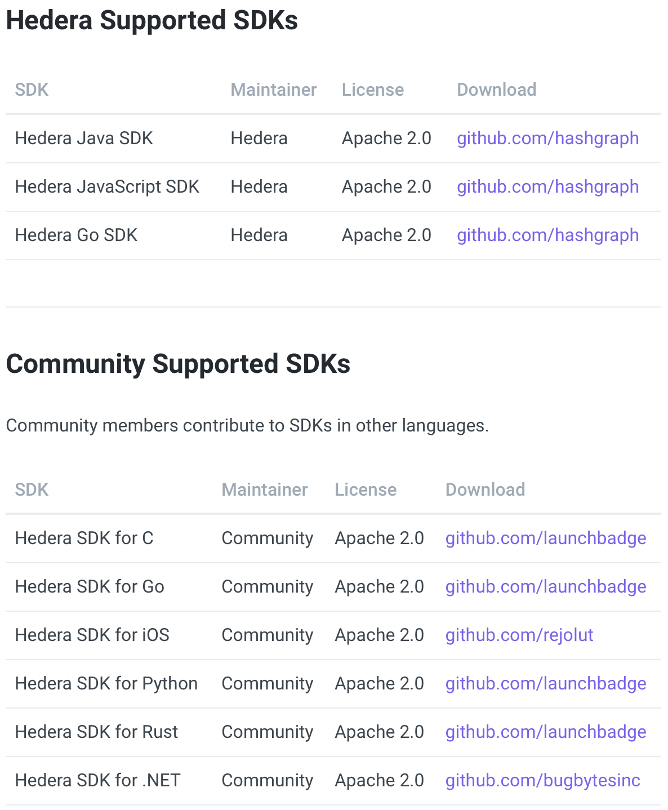

### 1.2.2 Microsoft Visual Studio Code(VS Code), Node.js 설치

**<u>본 실습에서는 Hedera JavaScript SDK기반으로 진행됩니다.</u>**

* Microsoft Visual Studio Code 설치 - https://code.visualstudio.com/download
* Node.js -https://nodejs.org

### 1.2.3 실습 소스 다운로드

```bash
$ git clone https://github.com/hlkug/meetup.git

$ cd meetup/202010/hands-on
$ ls 
```

### 1.2.4 VS Code에서 소스 코드 열기

1.2.3 에서 다운로드 받은 소스 폴더를 VS Code에서 오픈합니다.

* File -> Open : meetup/202010/hands-on/getting_started

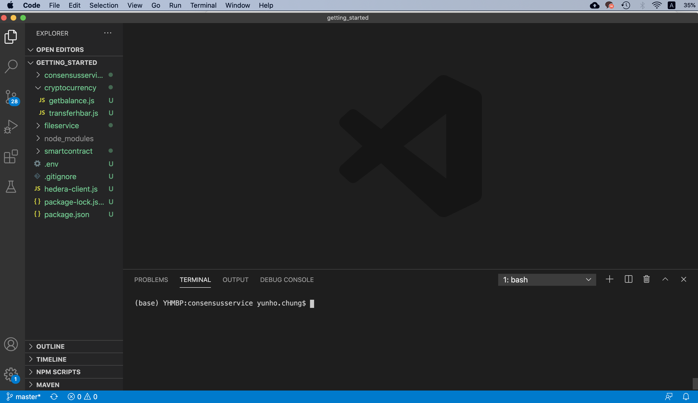

### 1.2.5 패키지(라이브러리) 설치

VS Code에서 Terminal 창을 오픈한 후 실습에 필요한 패키지를 설치합니다.

```bash
# 초기화
$ npm init -y
Wrote to /Users/yunho.chung/Git/hlkug/meetup/202010/hands-on/getting_started/package.json:

{
  "name": "getting_started",
  "version": "1.0.0",
  "description": "",
  "main": "hedera-client.js",
  "scripts": {
    "test": "echo \"Error: no test specified\" && exit 1"
  },
  "keywords": [],
  "author": "",
  "license": "ISC"
}

# Hedera SDK 라이브러리 다운로드
$ npm install --save @hashgraph/sdk

# dotenv 라이브러리 다운로드
$ npm install --save dotenv
```

### 1.2.6 Account 정보 설정

.env 파일에 본인의 Account 정보를 설정합니다.

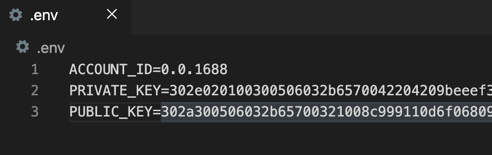

# 2. Cryptocurrency

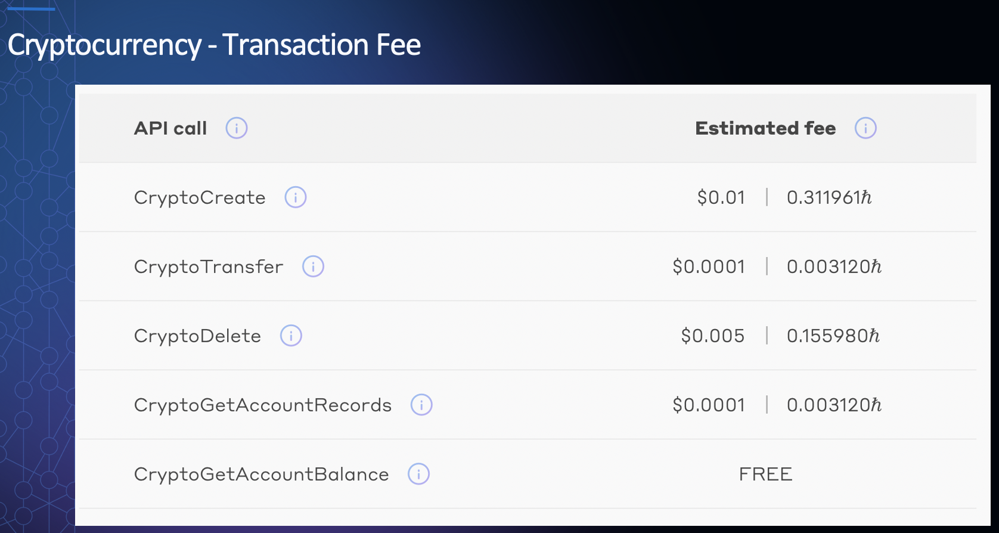

## 2.1 Balance 확인

* 파일: cryptocurrency/getbalance.js

```javascript
const HederaClient = require('./hedera-client');
const { AccountBalanceQuery } = require('@hashgraph/sdk');

async function getBalance() {
    const balance = new AccountBalanceQuery()
        .setAccountId(process.env.ACCOUNT_ID)
        .execute(HederaClient);
        
    console.log(`${HederaClient._operatorAccount} balance = ${(await balance).value()}`);
}

getBalance();
```

* 실행

```bash
$ cd $SOURCE_HOME/cryptocurrency
$ node getbalance.js
process.env.ACCOUNT_ID:  0.0.1688
0.0.1688 balance = 10000
```

## 2.2 HBar(tinybar) 송금

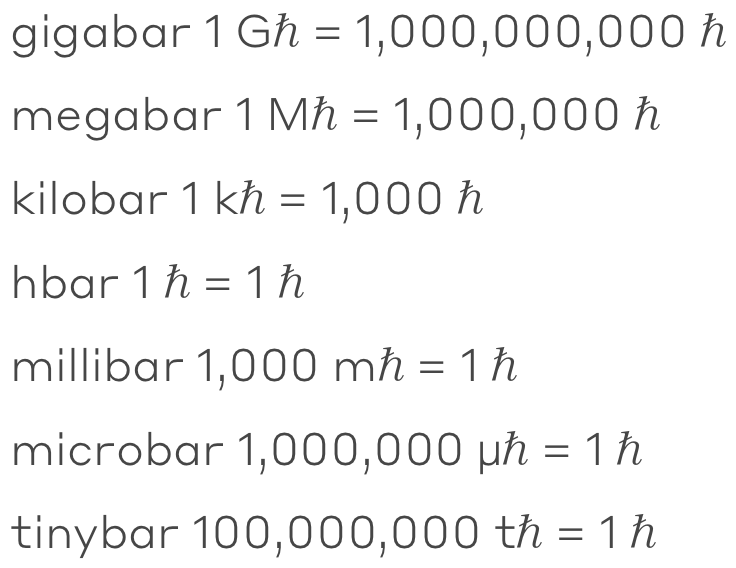

* 파일: cryptocurrency/transferhbar.js

```javascript
require('dotenv').config();
const HederaClient = require('./hedera-client');

const { Client, CryptoTransferTransaction } = require("@hashgraph/sdk");

async function transferHbar() {
    const myClient =  HederaClient; //Client.forTestnet();
    myClient.setOperator(process.env.ACCOUNT_ID, process.env.PRIVATE_KEY);

    const transactionId = await new CryptoTransferTransaction()
        .addSender(process.env.ACCOUNT_ID, 100)
        .addRecipient('0.0.3', 100)
        .execute(myClient);
    console.log('tx id:', transactionId);
    // const transactionReceipt = await transactionId.getReceipt(myClient);
    // console.log('reciept: ', transactionReceipt);

    const record = await transactionId.getRecord(myClient);
    console.log('reciept: ', record);
}

transferHbar();
```

* 실행

```bash
$ cd $SOURCE_HOME/cryptocurrency

# 송금전 Balance 확인
$ node getbalance.js 
process.env.ACCOUNT_ID:  0.0.1688
0.0.1688 balance = 9999.98474956

# HBar 송금(100 tinybar)
$ node transferhbar.js
process.env.ACCOUNT_ID:  0.0.1688
tx id: 0.0.1688@1602079806.560000000

reciept:  {
  "status": "SUCCESS"
}

record:  TransactionRecord {
  receipt: {
    "status": "SUCCESS"
  },
  transactionHash: Uint8Array(48) [
    179,  97, 249,  70, 134,  18, 141, 177, 223,
    117, 124, 101,   5, 137, 143, 179, 107, 169,
     98, 177, 234, 111, 240, 183, 117, 243, 104,
    137, 119, 102, 201, 114, 216, 216, 227,  87,
      4, 131, 197,  63, 127,  55,  78,  82, 129,
    228, 104,  15
  ],
  consensusTimestamp: Time { seconds: 1602079817, nanos: 34017000 },
  transactionId: 0.0.1688@1602079806.560000000,
  transactionMemo: '',
  transactionFee: 0.00254112,
  transfers: [
    { accountId: 0.0.3, amount: 0.00015597 },
    { accountId: 0.0.98, amount: 0.00238615 },
    { accountId: 0.0.1688, amount: -0.00254212 }
  ],
  [Symbol(callResult)]: null,
  [Symbol(callResultIsCreate)]: false
}

# 송금후 Balance 확인
$ node getbalance.js
process.env.ACCOUNT_ID:  0.0.1688
0.0.1688 balance = 9999.97966608
```

* 트랜잭션 확인

  https://testnet.dragonglass.me 에서 트랜잭션을 확인합니다.

  * https://testnet.dragonglass.me/hedera/accounts/{본인 Account ID}
  * 예> https://testnet.dragonglass.me/hedera/accounts/0.0.1688

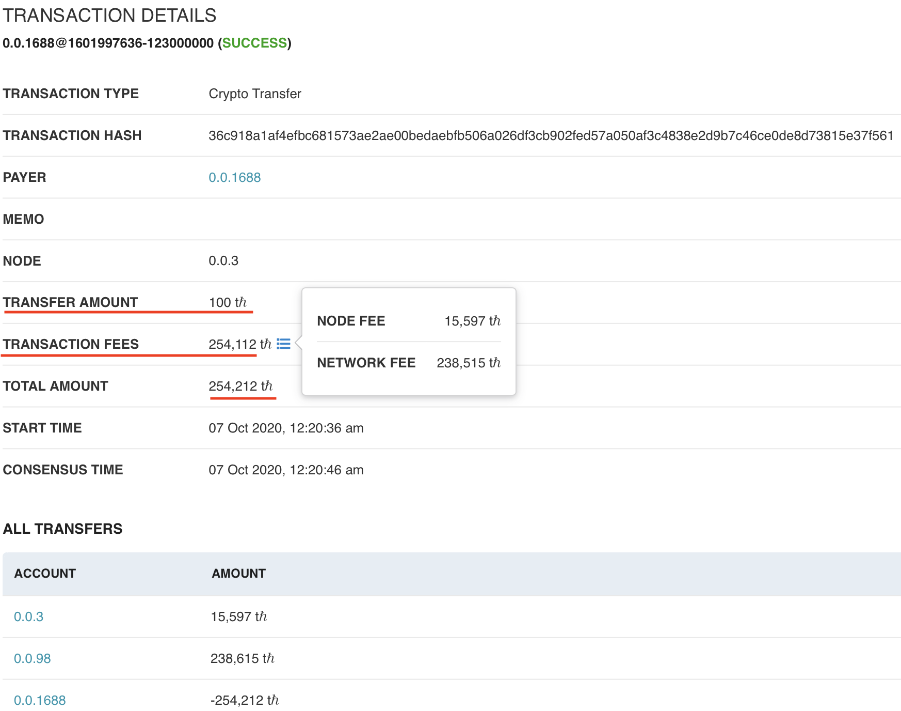

* 트랜잭션 수수료

  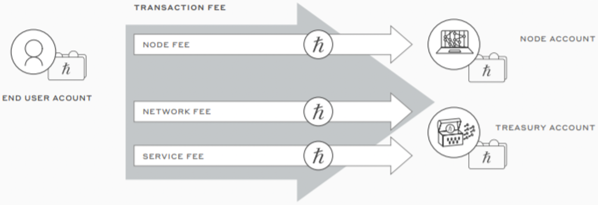

# 3. File Service

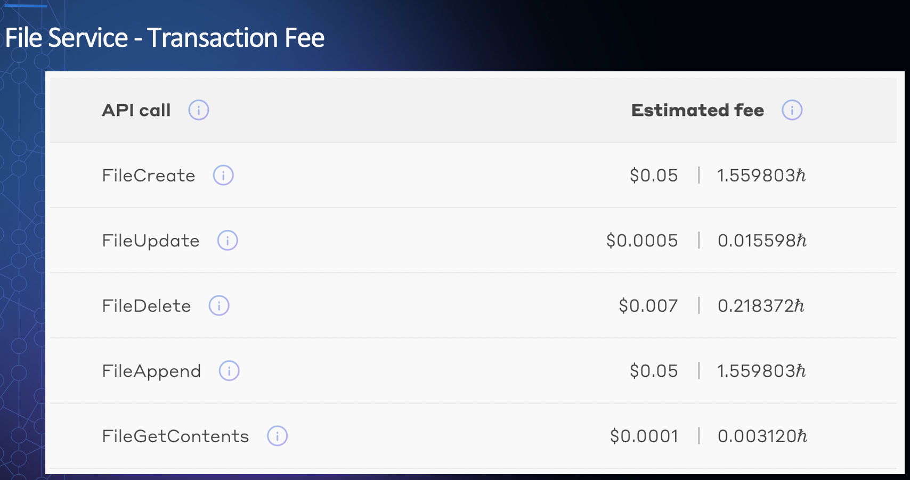

## 3.1 파일 생성 & 읽기

* 파일: fileservice/create_read.js

```javascript
const { Client, FileCreateTransaction, FileContentsQuery, FileInfoQuery, FileDeleteTransaction, Ed25519PrivateKey, Hbar } = require("@hashgraph/sdk");
require('dotenv').config({ path: '../.env' });

async function main() {
  console.log('process.env.ACCOUNT_ID:', process.env.ACCOUNT_ID);

  const operatorAccount = process.env.ACCOUNT_ID;
  const operatorPrivateKey = Ed25519PrivateKey.fromString(process.env.PRIVATE_KEY);
  const operatorPublicKey = operatorPrivateKey.publicKey;

  if (operatorPrivateKey == null || operatorAccount == null) {
    throw new Error(
      "environment variables OPERATOR_KEY and OPERATOR_ID must be present"
    );
  }

  const client = Client.forTestnet()
  client.setOperator(operatorAccount, operatorPrivateKey);

  // 파일 생성
  const transactionId = await new FileCreateTransaction()
    .setContents("Hello, Hedera's file service!")
    .addKey(operatorPublicKey) // Defines the "admin" of this file
    .setMaxTransactionFee(new Hbar(15))
    .execute(client);

  const receipt = await transactionId.getReceipt(client);  
  const fileId = receipt.getFileId();
  console.log('tx id:', receipt);
  console.log("new file id = ", fileId);

  // 파일 읽기
  const fileContents = await new FileContentsQuery()
    .setFileId(fileId)
    .execute(client);

  console.log(`file contents: ${new TextDecoder().decode(fileContents)}`);

  // 파일 정보 조회
  const fileInfo = await new FileInfoQuery()
    .setFileId(fileId)
    .execute(client);

  console.log('fileInfo:', fileInfo);
}

main();
```

* 실행

```bash
$ cd $SOURCE_HOME/fileservice
$ node create_read.js 
process.env.ACCOUNT_ID: 0.0.1688
tx id: {
  "status": "SUCCESS",
  "fileId": "0.0.64778"
}
new file id =  0.0.64778

file contents: Hello, Hedera's file service!

fileInfo: {
  fileId: 0.0.64778,
  size: 29,
  expirationTime: 2021-01-06T22:14:16.000Z,
  isDeleted: false,
  keys: [
    302a300506032b65700321008c999110d6f068098ec344ecaaaaaba346a90a205ea7b15de6fdb6d82b7ddab8
  ]
}
```

## 3.2 파일 생성 & 삭제

* 파일: fileservice/create_delete.js

```javascript
const { Client, FileCreateTransaction, FileContentsQuery, FileInfoQuery, FileDeleteTransaction, Ed25519PrivateKey, Hbar } = require("@hashgraph/sdk");
require('dotenv').config({ path: '../.env' });

async function main() {
  console.log('process.env.ACCOUNT_ID:', process.env.ACCOUNT_ID);

  const operatorAccount = process.env.ACCOUNT_ID;
  const operatorPrivateKey = Ed25519PrivateKey.fromString(process.env.PRIVATE_KEY);
  const operatorPublicKey = operatorPrivateKey.publicKey;

  if (operatorPrivateKey == null || operatorAccount == null) {
    throw new Error(
      "environment variables OPERATOR_KEY and OPERATOR_ID must be present"
    );
  }

  const client = Client.forTestnet()
  client.setOperator(operatorAccount, operatorPrivateKey);

  // 파일 생성
  const transactionId = await new FileCreateTransaction()
    .setContents("Hello, Hedera's file service!")
    .addKey(operatorPublicKey) // Defines the "admin" of this file
    .setMaxTransactionFee(new Hbar(15))
    .execute(client);

  const receipt = await transactionId.getReceipt(client);  
  const fileId = receipt.getFileId();
  console.log('tx id:', receipt);
  console.log("new file id = ", fileId);

  // 파일 삭제
  const deleteFileTransactionId = await new FileDeleteTransaction()
  .setFileId(fileId) // Define which file to delete
  .setMaxTransactionFee(new Hbar(100))
  .execute(client); // Presumes the client is the file's admin key

  // After deletion, the receipt should NOT contain a file ID
  const deleteFileReceipt = await deleteFileTransactionId.getReceipt(client);
  console.log("deleted file receipt, won't contain a file ID ", JSON.stringify(deleteFileReceipt) + "\n");  
}

main();
```

* 실행

```bash
$ cd $SOURCE_HOME/fileservice
$ node create_delete.js 
process.env.ACCOUNT_ID: 0.0.1688
tx id: {
  "status": "SUCCESS",
  "fileId": "0.0.64779"
}
new file id =  0.0.64779
deleted file receipt, won't contain a file ID  {"status":"SUCCESS"}
```

* 트랜잭션 확인

  https://testnet.dragonglass.me 에서 트랜잭션을 확인합니다.

  * https://testnet.dragonglass.me/hedera/accounts/{본인 Account ID}
  * 예> https://testnet.dragonglass.me/hedera/accounts/0.0.1688

# 4. Smart Contract

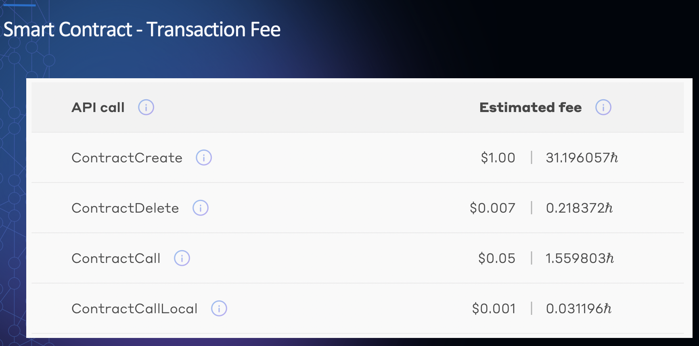

## 4.1 스마트 컨트랙트 배포 및 함수 실행

* 제약 사항
  * Hedera smart contracts support Solidity versions up to v0.5.9.
  * Each smart contract has **<u>a maximum state size of 1MB</u>** which can store up to approximately **<u>16,000 key-value pairs</u>**.
* 파일: smartcontract/create_get_set.js

```javascript
/**
* Solidity Support
Hedera smart contracts support Solidity versions up to v0.5.9.
 
* Smart Contract State Size
Each smart contract has a maximum state size of 1MB which can store up to approximately 16,000 key-value pairs.
 */
const { 
    Client, FileCreateTransaction, ContractCreateTransaction,
    ContractFunctionParams, ContractCallQuery, ContractExecuteTransaction,
    Ed25519PrivateKey,
    Hbar 
} = require("@hashgraph/sdk");
require('dotenv').config({ path: '../.env' });

async function main() {
    const operatorAccount = process.env.ACCOUNT_ID;
    const operatorPrivateKey = Ed25519PrivateKey.fromString(process.env.PRIVATE_KEY);

    // `Client.forMainnet()` is provided for connecting to Hedera mainnet
    const client = Client.forTestnet();

    // Defaults the operator account ID and key such that all generated transactions will be paid for
    // by this account and be signed by this key
    client.setOperator(operatorAccount, operatorPrivateKey);


    const smartContract = require("./stateful.json");
    const smartContractByteCode = smartContract.contracts[ "stateful.sol:StatefulContract" ].bin;

    console.log("contract bytecode size:", smartContractByteCode.length, "bytes");

    // 파일 생성(스마트 컨트랙트)
    const byteCodeFileId = (await (await new FileCreateTransaction()
        .setMaxTransactionFee(new Hbar(3))
        .addKey(operatorPrivateKey.publicKey)
        .setContents(smartContractByteCode)
        .execute(client))
        .getReceipt(client))
        .getFileId();

    console.log("contract bytecode file:", byteCodeFileId.toString());

    // 스마트 컨트랙트 생성(with File ID)
    const record = await (await new ContractCreateTransaction()
        .setMaxTransactionFee(new Hbar(100))
        // Failing to set this to an adequate amount
        // INSUFFICIENT_GAS
        .setGas(2000) // ~1260
        // Failing to set parameters when parameters are required
        // CONTRACT_REVERT_EXECUTED
        .setConstructorParams(new ContractFunctionParams()
            .addString("hello from hedera"))
        .setBytecodeFileId(byteCodeFileId)
        .execute(client))
        .getRecord(client);

    const newContractId = record.receipt.getContractId();

    console.log("contract create gas used:", record.getContractCreateResult().gasUsed);
    console.log("contract create transaction fee:", record.transactionFee.asTinybar());
    console.log("contract:", newContractId.toString());

    // getMessage() 함수 호출(Query...)
    let callResult = await new ContractCallQuery()
        .setContractId(newContractId)
        .setGas(1000) // ~897
        .setFunction("getMessage", null)
        .execute(client);

    console.log("\ncall gas used:", callResult.gasUsed);
    console.log("message:", callResult.getString(0));

    // setMessage() 함수 호출(Transaction...)
    const getRecord = await (await new ContractExecuteTransaction()
        .setContractId(newContractId)
        .setGas(7000) // ~6016
        .setFunction("setMessage", new ContractFunctionParams()
            .addString("hello from hedera again!"))
        .execute(client))
        // [getReceipt] or [getRecord] waits for consensus before continuing
        //      and will throw an exception
        //      on an error received during that process like INSUFFICENT_GAS
        .getRecord(client);

    console.log("\nexecute gas used:", getRecord.getContractExecuteResult().gasUsed);

    // getMessage() 함수 호출(Query...)
    callResult = await new ContractCallQuery()
        .setContractId(newContractId)
        .setGas(1000) // ~897
        .setFunction("getMessage", null)
        .execute(client);

    console.log("\ncall gas used:", callResult.gasUsed);
    console.log("message:", callResult.getString(0));

    client.close();
}

main();
```

* 실행

```bash
$ cd $SOURCE_HOME/smartcontract
$ node create_get_set.js 
contract bytecode size: 2478 bytes
contract bytecode file: 0.0.64783
contract create gas used: 1260
contract create transaction fee: BigNumber { s: 1, e: 9, c: [ 1262941963 ] }
contract: 0.0.64784

call gas used: 897
message: hello from hedera

execute gas used: 6016

call gas used: 897
message: hello from hedera again!
```

* 트랜잭션 확인

  https://testnet.dragonglass.me 에서 트랜잭션을 확인합니다.

  * https://testnet.dragonglass.me/hedera/accounts/{본인 Account ID}
  * 예> https://testnet.dragonglass.me/hedera/accounts/0.0.1688

  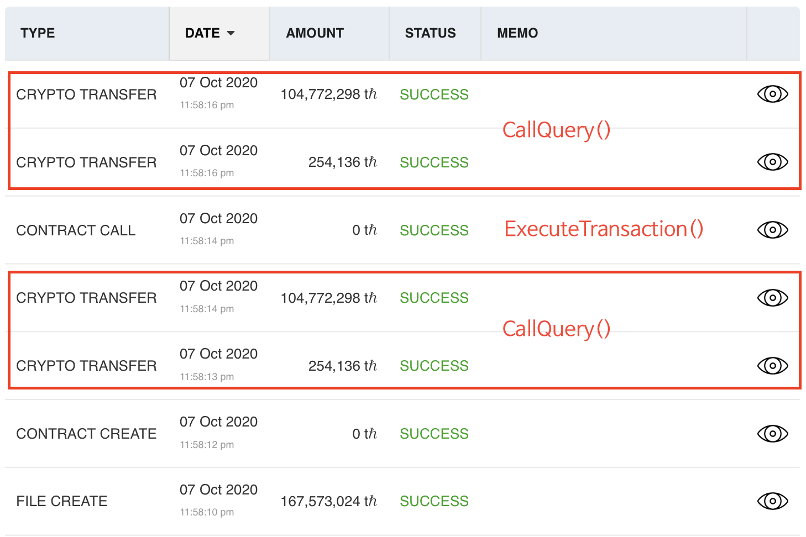

# 5. Consensus Service

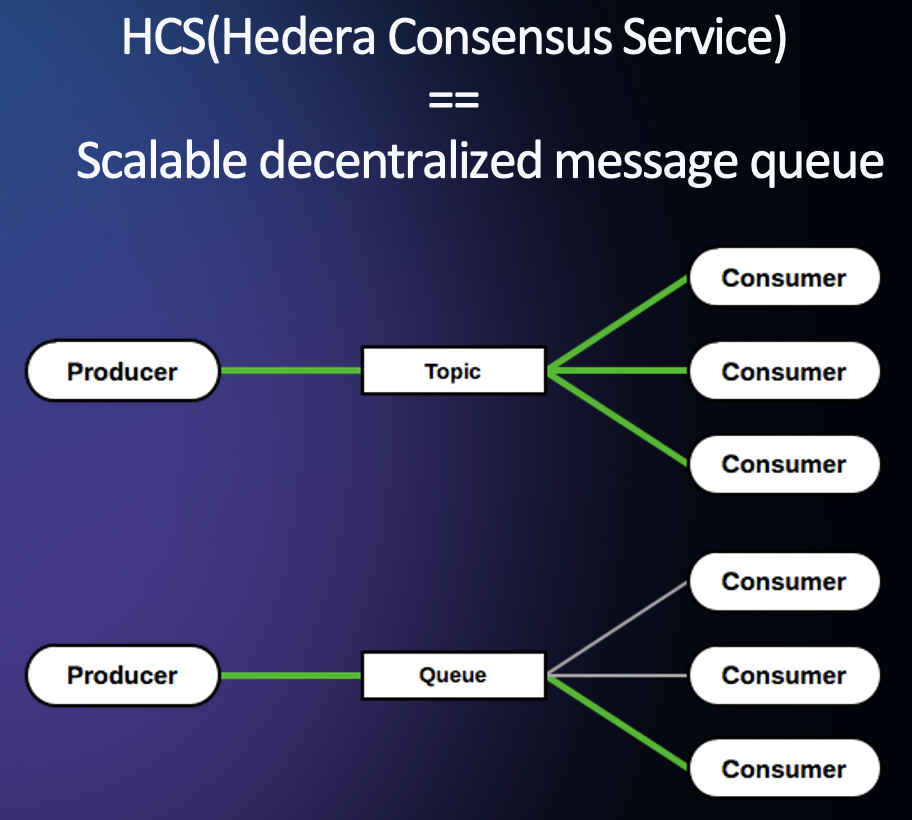

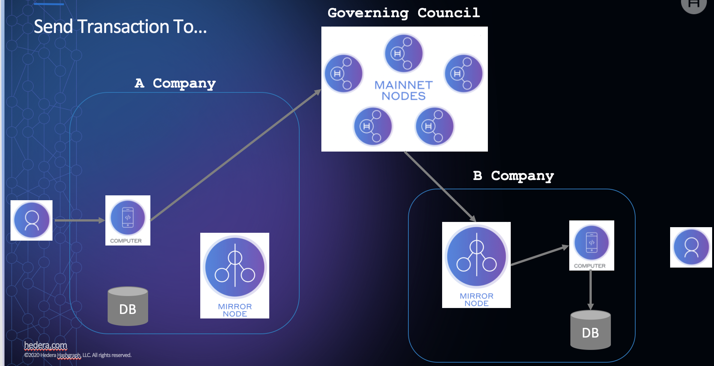

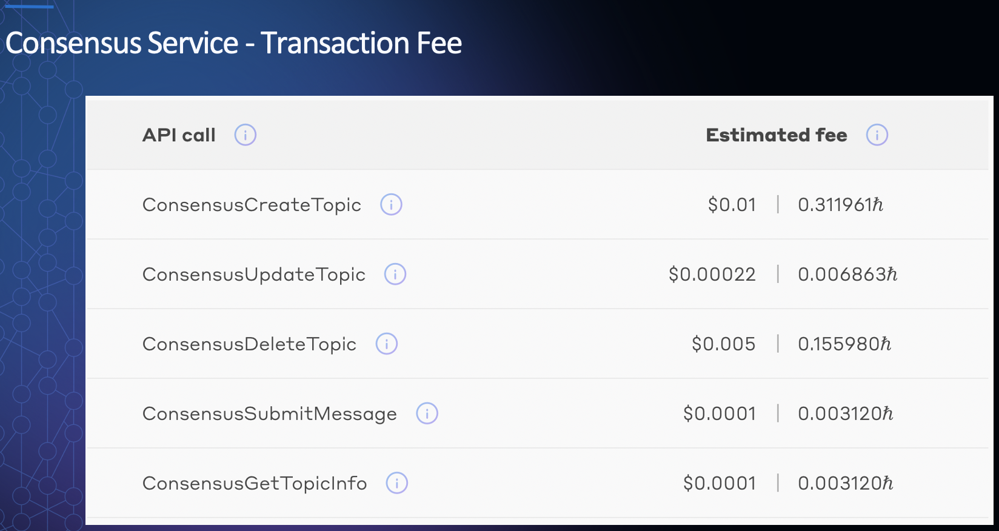

## 5.1 토픽 생성 및 Submit/Subscribe

* 파일: consensusservice/submit_subscribe.js

```javascript
require('dotenv').config({ path: '../.env' });

const {
    Client, MirrorClient, MirrorConsensusTopicQuery,
    FileCreateTransaction, ContractCreateTransaction, Hbar, Ed25519PrivateKey,
    ContractFunctionParams, ContractCallQuery, ContractExecuteTransaction,
    ConsensusMessageSubmitTransaction,
    ConsensusTopicCreateTransaction
} = require("@hashgraph/sdk");
const HederaClient = require('../hedera-client');

async function main() {
    // const myClient = Client.forTestnet();
    const myClient = HederaClient;

    myClient.setOperator(process.env.ACCOUNT_ID, process.env.PRIVATE_KEY);

    const transactionId = await new ConsensusTopicCreateTransaction().execute(myClient);
    const transactionReceipt = await transactionId.getReceipt(myClient);
    const topicId = transactionReceipt.getConsensusTopicId();

    console.log('topid id = ', topicId);

    await sleep(5000); // Consensus에서 생성된 토픽을 미러노드에서 인지할 수 있게 delay
    // const myMirrorClient = new MirrorClient('hcs.testnet.mirrornode.hedera.com:5600');
    const myMirrorClient = new MirrorClient('api.testnet.kabuto.sh:50211');

    new MirrorConsensusTopicQuery()
    .setTopicId(topicId)
    .subscribe(
        myMirrorClient, 
        (message) => console.log('<<< Received message from Mirror Node:', message.toString()),
        (error) => console.log(`Error: ${error.toString()}`));

    for(let i = 1; i < 4; i++) {
        let hcsMessage = await new ConsensusMessageSubmitTransaction().setTopicId(topicId).setMessage(`Hello, HCS! From Message ${i}`).execute(myClient);
        let hcsMessageReceipt = await hcsMessage.getReceipt(myClient);

        console.log(`>>> Sent message ${i}: ${hcsMessageReceipt.toString()}`);
    }
}

function sleep(ms) {
    return new Promise((resolve) => setTimeout(resolve, ms));
}

main();
```

* 실행

```bash
$ cd $SOURCE_HOME/consensusservice
$ node submit_subsccribe.js 
process.env.ACCOUNT_ID:  0.0.1688
topid id =  0.0.66074
>>> Sent message 1: {
  "status": "SUCCESS",
  "consensusTopicRunningHash": "145,180,159,133,26,126,45,234,255,143,136,89,122,202,186,66,154,64,215,26,95,60,13,90,8,94,167,131,249,47,34,244,57,200,175,15,106,178,67,43,175,49,138,194,102,36,255,38",
  "consensusTopicSequenceNumber": 1
}
<<< Received message from Mirror Node: Hello, HCS! From Message 1
>>> Sent message 2: {
  "status": "SUCCESS",
  "consensusTopicRunningHash": "107,32,234,35,80,59,99,230,84,44,64,204,189,34,2,36,13,169,117,203,27,236,37,36,34,44,154,187,254,9,29,212,83,245,177,39,14,247,105,170,159,69,153,13,201,32,87,179",
  "consensusTopicSequenceNumber": 2
}
<<< Received message from Mirror Node: Hello, HCS! From Message 2
>>> Sent message 3: {
  "status": "SUCCESS",
  "consensusTopicRunningHash": "253,240,50,138,90,128,164,147,253,190,48,61,8,19,139,189,22,18,160,83,91,17,188,22,83,18,44,176,42,121,5,242,77,159,212,190,140,104,148,130,220,234,231,83,185,144,218,19",
  "consensusTopicSequenceNumber": 3
}
<<< Received message from Mirror Node: Hello, HCS! From Message 3
```

* 트랜잭션 확인

  https://testnet.dragonglass.me 에서 트랜잭션을 확인합니다.

  * https://testnet.dragonglass.me/hedera/accounts/{본인 Account ID}

  * 예> https://testnet.dragonglass.me/hedera/accounts/0.0.1688

    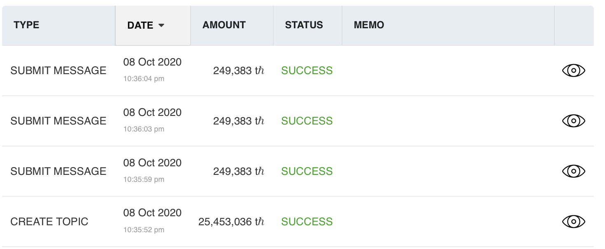

   https://explorer.kabuto.sh/testnet 에서 트랜잭션을 확인합니다.

  * https://explorer.kabuto.sh/testnet/id/{본인 Account ID}

  * 예> https://explorer.kabuto.sh/testnet/id/0.0.1688

    


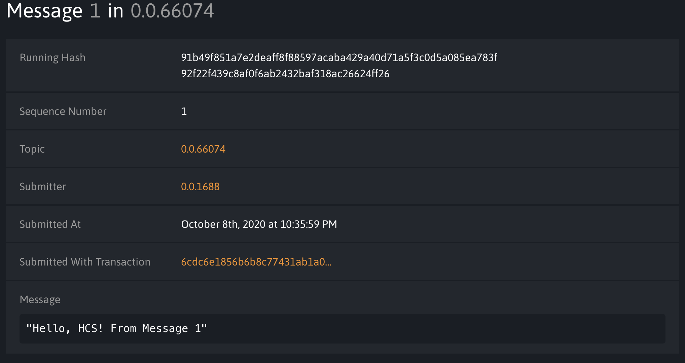